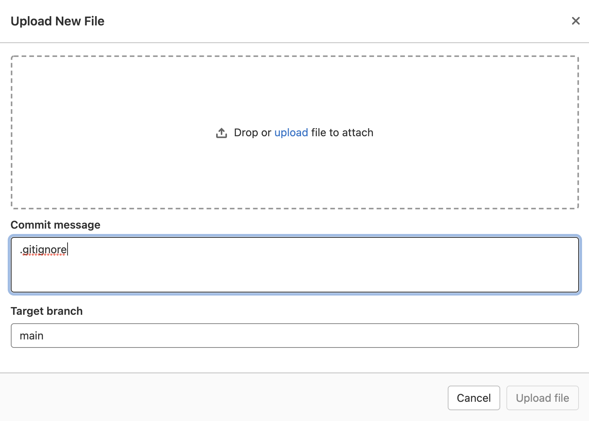

# Gitlab

## 1. Creatting a personal repository with the correct .gitignore and simple README.MD;

First, we should make a repository with README.MD:
| 
| ------ |
Choose "Create blank project"
| 
| ------ |
Choose to initialize it with README.MD and then press "Create project"
After that we need to add .gitignore manually 
| 
| ------ |

## 2. Creating develop and master branches;

### Using GitLab:
Master branch (or main) is created automatically. To add another branch you should hover on ***"Repository"*** (left window) and choose ***"Branches"*** . Press ***"New branch"*** and write it's name, then press ***"Create branch"*** . If you have other branches you can also choose which branch should be a parent branch.
| 
| ------ |

### Manually:
To add develop branch we should clone the repository on a computer (using SSH or HTTPS link).
We need to use command ***git checkout -b develop*** in your system's command line (cmd/shell/iTerm...). After creating a branch you should do an initial commit (even if you didnt do anything), so you can go back later if necessery.
The only thing left is to push it. ***git push origin develop*** like we did with 'git checkout' write it in your command line. Now we have 2 bracnhes on our gitlab.

## 3. Setting the develop branch as the default; 

Go to ***Settings > Repository > Default branch*** and choose it.
| 
| ------ |

As you can see, 'develop' is now a default branch.
| 
| ------ |

## 4. Creating an issue for creating the current manual; 

Go to ***Issues*** press 'New issue' and write everything you need in the template.
| 
| ------ |

| 
| ------ |

## 5. Creating a branch for the issue;

Go to ***Issues***, press on the wanted issue, press the arrow near ***Create merge request*** button and press ***Create branch***.
| 
| ------ |
| 
| ------ |

## 6. Creating a merge request on the develop branch;

Go to ***Branches*** and find ***Merge request*** button on the develop branch. 
You can see it on screenshot below. There is only button on ***main*** branch, because ***develop*** has no child branches.
| 
| ------ |

## 7. Commenting and accepting the request;

Find this button on the top right side of the UI.
| 
| ------ |

Choose the request you want to work with.
| 
| ------ |

Find the comment window and write everything you need. After that, press the ***Close merge request button***.
| 
| ------ |

## 8. Creating a stable version in the master with a tag;

Go to ***Repository > Tags*** and press ***New tag***. Write everything you need in the opened template.
| 
| ------ |

## 9. Working with wiki for the project.

Go to ***Wiki*** and press ***Create your first page***. Write everything you need in the opened template(yes i wrote it again) and press ***Create page***. 
| 
| ------ |

The list of the pages will be on the right side of ***Wiki*** window.
| 
| ------ |

